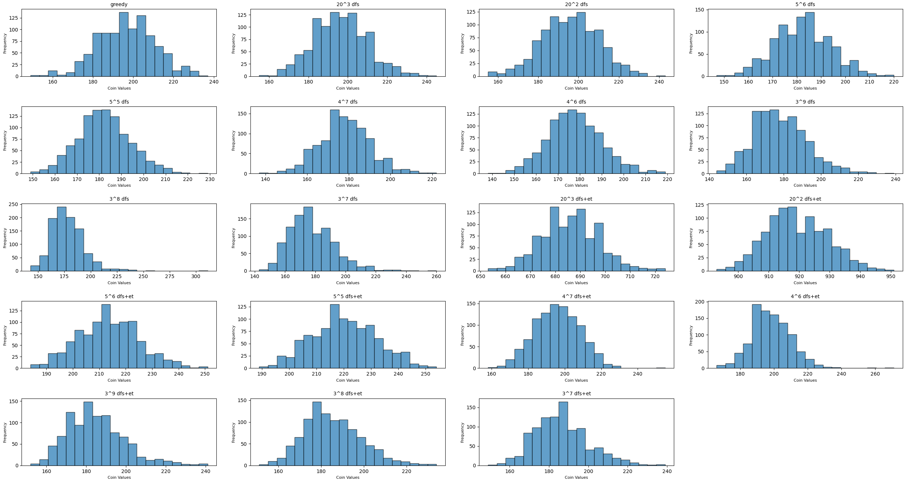

# ssbm-lotto-rng-manip

This project goes into understanding how random number generation (RNG) works for *Super Smash Bros. Melee*'s lottery minigame and adventure mode minigame with a specific focus on application towards improving the All Trophies Speedrun. As a result of these efforts, we now have scripts that enable speedrunners to save at least an hour per each All Trophies run thanks to real time RNG manipulation, as well as other scripts that enable speedrunners of other categories to not have to reset on boot.

SSBM's RNG relies on a [Linear Congruential Generator](https://en.wikipedia.org/wiki/Linear_congruential_generator) to generate random numbers. These functions are definite and their sequence will never change as their purpose is to provide a "randomly generated" sequence of numbers from 1 to whatever the maximum number is. In the case of Melee, the maximum number is 2^32 - 1, which is roughly 4.3 billion values. The scripts in this repo are optimized to avoid having to iterate over every single one of the 4.3+ billion seeds. I started this project in Python because I thought this project would be relatively quick and small, which ended up being an extreme understatement. That being said, Python's slower speeds compared to languages such as C or Rust aren't too much of an issue thanks to the optimizations made in the Reverse Seed Search (RSS) algorithm, thanks to TauKhan.

# Check Out Other SSBM Tools!

https://github.com/Olivia926/All_Trophies_Help

That's the collection of tools which are relevant to SSBM's All Trophies any% speedrun, but this repo is the main repo that I'll be contributing to for ease of use.

# Getting Started

To get started, make sure you have Python installed and in your PATH. Download this repository as a zip folder, and extract the contents of the zip folder to a new one. Create a terminal and navigate to the folder in the terminal, then type `python [FILENAME].py`. Note that depending on your Python installation, you might have to call `python3` instead.

## I'm a runner and I don't know what scripts to use:
For any speedruns which may require birdo in any way, `initial_birdo.py` should be used.

For the all trophies speedrun, `initial_birdo.py` is used at the beginning, then `initial_lotto.py`, followed up by `end_lotto.py`, and finally `end_adv1_1.py` to end the run. Note that the lottery must be completed before the end of the adventure run! This is because that's the order that I tested the scripts in, and any inconsistencies might result in the scripts being completely unusable. Please note that the exact order for using each of these scripts may be variable as the route of the run improves over time.

## Brief explanation of notable files:
`initial_birdo.py` is meant to be used at the beginning of a speedrun to get Birdo from the lottery using the first $5$ coins that the player is given. Note that this file is heavily commented; this is meant to be a learning resource for anyone who is learning about how I manipulate SSBM's RNG!

`initial_lotto.py` is meant to be used when collecting $\frac{83}{84}$ of the trophies from the lottery with less than $170$ coins near the beginning of a run.

`end_lotto.py` is intended to be used at the end of an all trophies run, but before the `end_adv1_1.py` script.

`end_adv1_1.py` is intended to be used at the end of an all trophies run.

`tagrss.py`is TauKhan's extremely efficient implementation of tagRSS (explanation below). This isn't meant to be run by itself.

`globals.py` handles all of the additional utility calls and contains specific lists of trophies. This file helps to reduce duplicate code across multiple files by keeping it in one central location.

`./old_scripts_and_other/trophies.txt` is a list of all the trophies in the game that are needed, with certain names being adjusted due to duplicate or confusing names.

## A note about the old_scripts_and_other folder
All the files in the `old_scripts_and_other` folder are not meant to be run. These are archived pieces of code that I may refer to for niche bits of logic here and there, but they are either outdated and do not do the things that are required for the speedrun, or are very inefficient.

The only notable files here are the `lotto_trophies.txt` and `trophies.txt` lists, which are the lists of trophies in the order that the game keeps them, which was used to construct the smaller lists in `globals.py`. Lastly, the `coin_spending_logs` folder is useful for understanding coin distributions and other statistics which were useful for developing an improved algorithm which is used in `initial_lotto.py`.

---

## TODO (ordered by importance):

- ~~Create a script for when a runner is looking to unlock all trophies at the end of the run (`end_lotto.py`)~~
- ~~Implement a better algorithm besides the greedy algorithm for unlocking trophies~~
- Rewrite this file so it's more readable and has a better narrative.
- Implement course correction (create a way for scripts to undo mistakes or recompute the current seed if the user misinputs) [this is not likely to be implemented since it is very time consuming... in other words, be careful when inputting!]
- ~~Fix `end_adv1_1.py` bugs~~
- ~~Create an easier way to reduce repeated logic for new scripts~~
- ~~Fix readme issues (incorrect information due to misremembering)~~
  - ~~Explanation of improved RSS algorithm by explaining how `get_rand_int()` works~~
  - ~~Explanation of new routing + previous assumptions which no longer hold~~
- ~~Create a script for adv 1-1 trophy manip (including birdo unlock)~~

## What is RSS (reverse seed search)?

In a real run, the RNG value or seed will change any time a function is called that requires the seed. In order to manipulate the RNG, we first need to determine what the seed is. This introduces a new question: What is reverse seed search (RSS)?

RSS is an algorithm that finds the seed of the current game. One might wonder if it's possible to directly read the memory of the game to access this value, and you absolutely can, but it would be unfair if you could directly read the memory values of the game, and there are very few tools that can verify that rng hasn't been tampered with in real runs. Additionally, thanks to the work from the community, we do know how the random seed is used in _some_ functions. Combine this with the fact that Melee's RNG runs on an LCG, and we might just be able to figure out what the current seed is when given any sequence of random events. More information can be found near the end!

---

# An In-Depth Explanation of SSBM's RNG system

The RNG value, or seed, is at the heart of what drives randomness and is just a LCG. The LCG has already been discovered to be the following function:

$seed = ((a * seed) + c) \% m$

Where $a = 214013$, $c = 2531011$, and $m = 2^{32}$.

The next step is to use this seed to generate a desired number. For example, if we want to pull a random number from $[0, 100)$ (that is, including $0$ and excluding $100$), but our seed value is $123456$, Melee doesn't say that the random number that we get from $[0, 100)$ is just $123456$. Instead, Melee calls a function that takes our current seed, makes the seed "step" once according to the LCG function, then manipulates it to generate a number within the ranges of $[0, 100)$, and then returns that newly generated number.

There are two functions where this happens which I call `get_rand_int()` and `get_rand_float()`. As noted by Savestate, one of the folks who have looked into RNG in Melee way before I have, the `get_rand_int()` function is frequently used for purposes that we're interested in, whereas `get_rand_float()` seems to have something to do with CPU behavior, or recursive particle generation. TauKhan has noted that one of the main issues with our current understanding of Melee's RNG is our current lack of the recursive particle generation function, the knowledge of which could aid in more optimal RNG manipulation in the future. (For those who are curious, the only way that we will likely learn more about that function is dependent on the pace of the [SSBM Decompilation Project](https://decomp.dev/doldecomp/melee).)

Regardless, we now have our sights set on the `get_rand_int()` function!

The `get_rand_int()` function causes the seed to step once and then generate a new number. The proper declaration for the function is `get_rand_int(num)` where `num` is an int, and the returned value of the function is any number from 0 to `num - 1`. This means that if I were to call `get_rand_int(10)`, it would cause the seed to step once, then do some math to use the new seed and return a number from 0 to 9 inclusive. The exact implementation has been rewritten in my code to take place in one line, and is defined as the following: 

`((num * ((214013 * seed + 2531011) & 4294967295) >> 16) >> 16)`

To break this down step by step, we know that `get_rand_int(num)` advances the rng once, which is defined as:

`(214013 * seed + 2531011) & 4294967295`

Then, `get_rand_int(num)` takes the seed output by the above line and shifts it 16 bits to the right. It then multiplies the result by `num`, and shifts the product by another `16` bits, which guarantees an output that is greater than zero and strictly less than `num`.

## How Does This Tie Into The Lottery?

Thanks to some of Judge9's scripts, [Dolphin-memory-engine](https://github.com/aldelaro5/dolphin-memory-engine), and Dolphin's debugging mode, I was able to take a look at how RNG moves when the player interacts with the lottery minigame. The way the lottery minigame works is very simple. The user can enter in anywhere from 1 to 20 coins (inclusive) and the lottery returns a trophy. I then looked at the seed when entering different amounts of coins, and I noticed that the seed would move $3x + 4$ steps per each coin spent, that is, 1 coin would cause the seed to step 7 times, 2 coins would cause the seed to step 10 times, and so on.

`3 steps` (aka 3 calls to the `get_rand_int()` function) would be performed per each coin to randomize where their `x`, `y`, and `z` coordinates are when they spawn in for the animation where they enter the lottery machine. After those $3 *$ `number of coins spent` steps are made, then one call is made to determine the success or failure of the roll (that is, whether the trophy is new or not), then one call to determine the actual trophy that the player will receive, and then one call to determine the pose of the trophy (as some trophies have multiple poses). We can make a simple table to illustrate what the internal system looks like and what functions are being called when we roll for a trophy using only **ONE** coin:

| Table 1: Lottery Actions and RNG Calls |
| -------------------------------------- |

| Action Number | Seed In | Seed Out |   Description of Action   | Actual Function Called |
|:-------------:|:-------:|:--------:|:-------------------------:|:----------------------:|
|       1       |   s_1   |    s_2   |          No idea          |   `get_rand_int(15)`   |
|       2       |   s_2   |    s_3   |          No idea          |  `get_rand_float(??)`  |
|       3       |   s_3   |    s_4   |          No idea          |  `get_rand_float(??)`  |
|       4       |   s_4   |    s_5   |          No idea          |  `get_rand_float(??)`  |
|       5       |   s_5   |    s_6   |  Roll for success/failure |   `get_rand_int(100)`  |
|       6       |   s_6   |    s_7   |      Roll for trophy      |    _explained later_   |
|       7       |   s_7   |    s_8   | Trophy pose (unconfirmed) |  `get_rand_float(1?)`  |

At action number $1$, we can see that `get_rand_int(15)` actually takes in the first seed, $s_1$, manipulates it such that it becomes some seed $s_2$ (via the LCG function above), then returns an int from the range $[0, 15)$.

Note that the table does have some `??` values and a `1?` value, which is meant to mark that certain values may change due to certain internal variables that we currently do not have knowledge about. Fortunately for us, those exact values aren't necessary to keep track of, but we do need to keep track of the fact the function calls still do advance the seed. As a result, we can still utilize these functions in a different way: to advance the seed as necessary without doing any extra computation for returning any unneeded "random" integers.

Because the lottery screen doesn't have any extra rng calls, the rng value only changes when the user inputs some number of coins. As a result, we can think of the above logic as a loop and simply pass in the resulting rng value from one usage into the next usage and so on, thus allowing us to figure out if the values returned by the functions are desirable or not. Now all that's left is to figure out how exactly the RNG values are used by the `get_rand_int()` functions, and how we can fully simulate the lottery minigame itself!

# Figuring Out The Lottery

When simulating the lottery, we begin with a seed. We know that the RNG values are predictable at each step and we know exactly how the `get_rand_int()` function works, so we should be able to figure out exactly what trophy is output by the game, right?

Nope! The trophies that a player can get are split up into a few different categories. These are:

| Table 2: Lottery Trophy Categories |
| ---------------------------------- |

|              Category Name             | Abbreviation | # of Trophies |
|:--------------------------------------:|:------------:|:-------------:|
|                1P/Lotto                |     `1PL`    |       72      |
|                 1P Only                |     `1PO`    |       27      |
|        Lotto only after initial        |     `LOI`    |       12      |
|        Lotto only after 1P clear       |    `LO1P`    |       23      |
|   Lotto only after all chars unlocked  |     `LOC`    |       10      |
|          1P/Lotto after 200 vs         |    `1PLVS`   |       16      |
| Lotto only after 250 trophies unlocked |     `LOT`    |        4      |
|            Special Trophies            |     `ST`     |       48      |

All of the trophies that involve the lottery are denoted by the letter `L`, where all trophies that are only accessible via 1P or the lotto are followed by an `O`. Additionally, all trophies that are unlockable via the lottery and 1P modes are denoted as `1PL`.

The first two categories and the `1PLVS` category are the 1P (single player) categories, but the special thing about this ategory is that the trophies that spawn in 1P modes must belong to that first category. Therefore, it would be ideal to pick up as many of the `1PL` and `1PLVS` trophies as possible before trying to get all the `1PO` trophies.

All of the `ST` trophies are unlocked by completing different "achievements" of sorts, such as the Diskun trophy, which requires completing every Bonus except for the 1 million VS matches bonus.

The total number of trophies that a player can get from just the lottery and 1P mode is $212$. Then, there are $3$ fighter trophies per fighter, making for $3 * 26$ (including Shiek) $= 78$ trophies, which combined with $212$ gives a total of $290$ trophies: the exact number of trophies needed in order to complete the speedrun. Note that the game internally is prepared for $293$ trophies as there is code within the game that checks for $293$ trophies instead of $290$ sometimes, but this doesn't negatively affect us in any way.

The reason is because $3$ trophies are considered Japanese exclusive trophies, which are not accessible on the NTSC 1.02 version of the game (this might need to be fact checked). Regardless, the game does still award the achievement for collecting all trophies upon collecting $290$ trophies, and so the All Trophies speedrun is based on the player being awarded this achievement.

## How Does Melee Use RNG In The Lottery?

We can now figure out how many trophies are available inside the Lottery. For example, at the very beginning of the game, there are $2$ lottery categories available: `1PL` and `LOI`, which gives a total of $72 + 12 = 84$ possible trophies. When the game starts for the first time on a new save, it automatically gives the player a random trophy from the `1PL` category. That means that on a new save, $\frac{83}{84}$ trophies are available in the lottery. This fraction is exactly what the game uses to determine whether a new trophy should be rolled or not; it takes the number of unowned trophies of the current number of possible lottery trophies and divides it by the current number of possible lottery trophies. Again, since the initial lottery pool is `1PL` and `LOI`, there are $72 + 12 = 84$ possible trophies, and since $1$ trophy is given to the player on the launch of the game, we get: $\frac{84 - 1}{84} = \frac{83}{84}$ as the probability that a player gets a new trophy from the lottery, which we'll round down to the nearest integer and then assign to a variable named `chance`.

In **Table 1**, action number 5, which is the roll for success or failure is exactly what happens here: the `get_rand_int(100)` function is called and if the value returned is strictly less than `chance`, then the roll is a success. Note that each coin past the first coin increases `chance` by a flat $5$ per coin.

Fun fact: the probability of getting a new trophy is actually just $\lfloor$ `chance` $\rfloor$, which means that the stuff after the decimal point doesn't actually matter, which means that $3.14\%$ is equivalent to $3\%$.

When it comes to determining the actual trophy that's received from the lottery after the roll for success or failure, the game then iterates over a specific list of trophies which is dependent on success or failure.

In the case of success, Melee then goes over the list of all trophies and saves the number of trophies which are not yet owned by the player and are available in the lottery which I named `rem_trophies`, passes `rem_trophies` into **Table 1**, Action number 6, which is the roll for the trophy. Then, of the list of trophies unowned but available in the lottery, `get_rand_int(len(rem_trophies))` is called in order to return the index of a random trophy from `rem_trophies`. Lastly, dependent on the trophy, the game will call one more rng function to determine the trophy pose, however, this can vary from trophy to trophy as not all trophies have multiple poses.

In the case that a failure was rolled instead, then the game follows the same process as above except instead of looking at trophies that are not yet owned and available in the lottery, the game instead looks at trophies that are already owned and available in the lottery. That way, it guarantees that it returns a new trophy on a success roll or a duplicate trophy on a failure roll.

## What's The Fastest Way To Get The Trophies From The Lottery?

Since this is meant to be used for a speedrun and not just a showcase, optimizations will be necessary. It's obvious that adding more coins into the lottery machine takes more time, as each additional coin beyond $1$ coin will play an animation where it has to enter the machine. Additionally, the $3$ RNG calls per coin can also change the position of the coin, which might delay the start of the lottery animation. This is not entirely known, but also may not be worth considering as the time it would save would most likely not be worth it as we can simply aim to spend the fewest coins necessary. This is one of the first "minimization" goals that we can have with this algorithm: simply minimize the number of coins spent, and hope for the best.

Another minimization problem that we can consider is minimizing the number of rolls that have to be made, but this problem is extremely complex because each roll creates a new universe of possibilities: for example, if we get a Barrel Trophy by spending $1$ coin, but we get a Barrel Cannon Trophy by spending $2$ coins, then all subsequent trophies in each scenario will be different because the index of each trophy after the one that was received would be different. To then compute all possibilities would simply be $20^n$, where $n$ is the number of rolls that are being made, and $20$ is the base due to the fact that we can spend up to $20$ coins.

The issue with this minimization problem is the fact that the number of computations becomes impossible very quickly. Thankfully, with a lot of help from Dribbermelow, we found out that it's possible to break down the previous problem from $20^n$ to $3^n$.

## Limiting the coins spent from 20 to 3

First off, I ran 1000 simulations of the initial greedy implementation that I had so I could see the distribution of the total amount of coins spent, and I considered how we could go about computing future rolls instead of relying strictly on a greedy algorithm. The problem with a greedy algorithm is as follows: because it looks for the cheapest amount of coins that results in a new trophy every time, it could accidentally pick a less optimal path which results in the next cheapest trophy cost being higher than if it were to think ahead, for example, the greedy algorithm might take a path costing: `[1, 5, 2]`, when a path such as `[2, 1, 1]` might exist! This becomes a problem as the greedy path has a total cost of $1+5+2=8$ coins, whereas a cheaper path of $2+1+1$ might exist instead.

In order to think ahead, we can construct a tree to consider all our possibilities, but it was important to think about how the breadth and depth of the tree will vastly affect the performance of the algorithm. Consider the following table:

| Table 2: Computation Costs |
| ---------------------------------- |

|    |     20    |   5   |   4   |   3   |
|:--:|:---------:|:-----:|:-----:|:-----:|
|  1 |     20    |   5   |   4   |   3   |
|  2 |    400    |   25  |   16  |   9   |
|  3 |     8k    |  125  |   64  |   27  |
|  4 |    160k   |  625  |  256  |   81  |
|  5 |    3.2m   |  3125 |  1024 |  243  |
|  6 |    64m    | 15.6k |   4k  |  729  |
|  7 |   1.28b   | 78.1k | 16.4k |  2187 |
|  8 |   25.6b   |  390k | 65.5k |  6.5k |
|  9 |  5.12E+11 |  1.9m |  262k | 19.6k |
| 10 | 1.024E+13 |  9.7m |   1m  |  59k  |

We can see that having a tree of breadth 20 and depth 3 will require more computation ($20^3$) than a tree of breadth 3 and depth 8 ($3^8$)! Using trees, we can redefine the problem as follows:

Given a tree (which we will have to generate), how can we find a path from the root of the tree down to a leaf where the chosen path has the shortest total weight?

The immediate answer is to generate the tree, and once you reach the child of the tree, calculate the weight of the tree (this can typically be done by keeping track of the parent node and simply summing the weight of each parent up until the root), and keep a running minimum for the total cost. Therefore, each node or state would contain the following information: the parent node, the weight of each node (aka the amount of coins spent to get to the current node from the previous node; not cumulative), and the current depth.

Unfortunately for us this isn't all that's necessary as we also have to consider what trophies we're getting, depending on the script. If we're simply getting every trophy from the lottery as with `end_lotto.py`, the exact trophy that we recieve doesn't matter, but if we're getting every trophy from the lottery while making sure we don't complete the `LOI` set as with `initial_lotto.py`, this problem becomes a bit harder.

For the purposes of `initial_lotto.py`, since that file requires getting every trophy from the lottery with 1 remaining trophy from `LOI`, we will have to keep track of what trophies we're recieving, and whether the individual trophy belongs to `LOI`. This can be optimized to exclude the names of the trophies and instead just be a list of booleans in the same order as the list of `1PL` and `LOI` trophies. Next, we can combine the the concept of the parent node with the weight of each node as a list of costs which define the path to the current node; this is helpful because it allows us to traverse the tree that we're generating without having to store every single node. This ends up saving a lot of data! Additionally, by constructing and traversing the tree using DFS, we can save even more data than BFS, especially if we utilize early termination. Note also that this approach doesn't even come close to simulating the entire lottery, even for `initial_lotto.py` which would be approximately `20^83` computations. Instead, it breaks up the lottery into $3^9$ computation chunks about 9 times with a little left over, which allows us to make decently informed decisions as we think in bunches of 9 rolls at a time.

The first implementation of early termination is dependent upon the number of trophies that we actually collect when we take a certain path. Note that that's something that we weren't thinking about before, but is actually very important! We want to minimize the coins spent when traversing a path while also ensuring that we maximize the amount of trophies gained when traversing the same path. We can then optimize the problem by defining an early termination, which is that if we ever find a completed path of length $n$ that also picks up $n$ new trophies, then we can simply stop the search there and accept that as the "best" path that we can take! This means that through DFS, if the best path is $[1, 1, 1, 1, 1, 1, 1, 1, 1]$ (that is, $9$ ones), we will have considered that first, and the early terminate will save us $3^9 - 1$ computations, or $19.6k$ computations! That's a lot of effort saved!

While this early termination strategy doesn't guarantee that we get the best strategy every time, it absolutely saves on the number of computations, thus allowing a DFS search of $3^9$ to be much more feasible compared to a DFS search without an early termination.

## Capping the total amount of coins spent through simulations

With the early termination strategy in mind, I realized that I could apply another early termination strategy. As a sanity check to see if there would be any tangible benefit, I ran 1000 simulations of the lottery on randomly generated seeds to see how the new DFS algorithm fared with different breadths and depths with and without early termination!

Here we can finally see how each algorithm compares side by side! The main things to note were that the less depth we had, the higher the average total coin cost, which makes sense given that decisions would be slightly less optimal. Also, using early termination with large amounts of coins ends up with a really fast algorithm, but way too many coins being spent. The most important results were that running $3^9$ DFS with early termination gave results that were comparable with $3^9$ DFS *without* early termination, which meant that for the purpose of computing coin amounts, we might be able to simulate entire lotteries at a time, which allows speedrunners to be able to begin getting trophies from the lottery *only when the cost of doing so is less than a certain amount of coins*!

I ended up being able to implement this: a combination of RNG manipulation and lottery simulation meant that we can now guarantee that getting the $\frac{83}{84}$ trophies in `initial_lotto.py` will always cost less than $170$ coins, thanks to simulating lotteries and manipulating RNG in the case that the total cost is $\geq 170$.

Thus the second early termination could be implemented here as well; in the case that a simulation requires that the user spend $\geq 170$ coins, we can end the simulation immediately and begin the next simulation. This saves us from having to complete every single simulation, which ends up saving tens of thousands of computations per each simulation! This new approach is what I call the "coin saver" approach, as it's a decent bit more optimal than the old greedy approach!

# Reverse Seed Search (RSS): A New Type Of Problem

How do we even begin to manipulate RNG? First thing's first, we need to figure out where exactly we are, which means we need to figure out what seed we're at!

Algorithms for this already exist, and one of the first algorithms were implemented by Judge9 using the character select screen (CSS). It was already known that randoming a new character would advance the RNG 2 times consistently, which made for a relatively straightforward algorithm that takes in a sequence of randomly selected characters and outputs the exact seed that the user is on. The minimum length of a sequence of random characters to determine what the RNG seed is $9$, but keep in mind that the total number of possible seeds is $2^{32}$, which is approximately $4.3$ _billion_ values to try. Fortunately there are only 25 possible values to keep track of, which makes the program generally simple but still very helpful to have. More information can be found in Judge9's video here: https://youtu.be/wuLz2QptDkY. I would highly recommend watching this as it gives a great overview of the CRSS problem and how it was approached.

Sidenote: TauKhan also implemented a similar algorithm with a large amount of optimizations in order have extremely fast performance. Unfortunately they didn't post the code so it isn't used right now but Judge9's algorithm is more than enough and is used routinely for Peach's Break The Targets (BTT) speedrun, as well as a few other custom BTT Mismatch stages intended for Peach.

The next type of RSS algorithm is TagRSS, where generating player tags using the random button would advance the RNG 1 time. This problem became a bit more complex as the game stores the 5 most recent unique tags that are rolled, and would internally reroll until it got a new tag. The internal rerolls wouldn't be displayed, so in order for a player to determine if they're on the correct seed, there could be quite a few rerolls in between each tag, or very few rerolls in between. Luckily, TauKhan implemented an insanely optimized approach in Python which takes the 5 tags that a player rolls and figures out what the seed is by splitting up the possible seeds into buckets and determining whether certain seeds are viable by performing a series of linear transforms (this takes advantage of the fact that Melee's RNG system is an LCG). This is the `tagrss.py` file in the repo.

Lastly is LottoRSS, which is an extremely slow and old RSS function that isn't necessary and is very unoptimized. It was made by me, and remains unused, but it does technically exist, although it's probably in one of the old scripts in the `old_scripts_and_other` folder.

# Thank You For Reading!

Chances are, I probably didn't explain something very well, or you might have questions. In that case, feel free to reach out to me!

Here's a list of people whose work I used along the way: Savestate, achilles1515, PracticalTAS, TauKhan, and gainge (aka Judge9).

This project would have never been possible if not for them, and a special shoutout to David V. Kimball for making his documentary video on Melee's All Trophies category, and for all the work that he's put into getting this to work in the first place.

Additionally, shoutouts to the Stadium Discord for being an awesome place where other speedrunners can enjoy a variety of different categories belonging to the same game and for being so welcoming to newcomers like myself who have tons of questions!

<3
